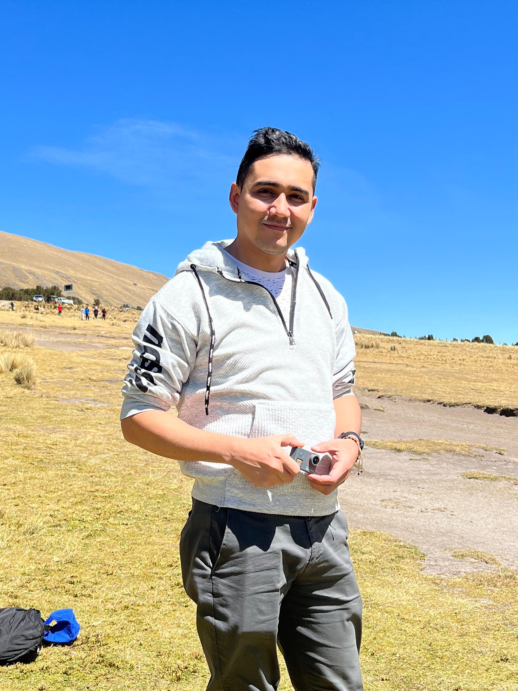

Soy Maykol Rey ingeniero electronico, tengo mas de 5 anos dedicandome al mundo del diseno de PCB. trabajo para una empresa de tecnologia industrial en el campo de la mineria en Peru.

He desarrollado placas para Unidades centrales de procesamiento con Nvidia, dispositivos para inteligencia artificial y un monton de proyectos adiciones de menos complejidad.

Tambien diseno carcasas para equipos electronicos usando solidWorks cmo herramienta principal, sin embargo solo lo uso para la empresa en la que trabajo, de forma personal uso [[Freecad]]. 

Soy usuario de linux y entusiasta del softawew libre, siempre que exista una solicion cerrada para windows o mac, exite una solucion para linux a la que se le coge mucho carino.

He desarrollado mi [blog personal](https://maykolrey.com) usanso Vuejs como framework, tengo un canal de [youtube](https://www.youtube.com/channel/UCuCl93NjLSbGbJEF4IzGWRg) donde enseno cosas relacionadas a la electronica y bueno tambien soy miembro  del grupo de telegram [Open Hardware LA](https://t.me/openhardwarelatinoamerica)

